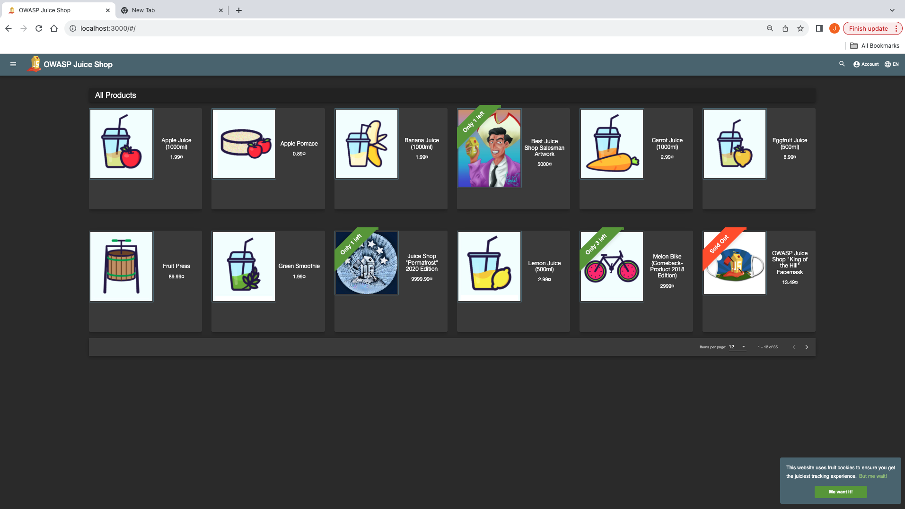
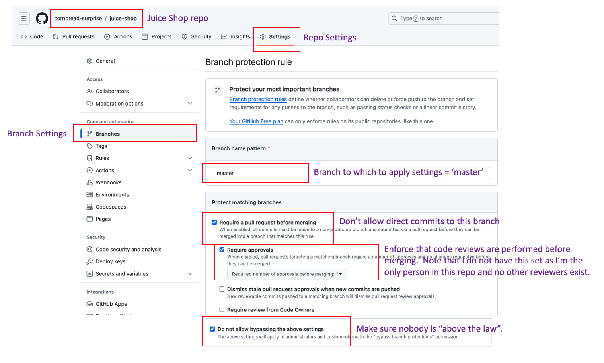

# Steps followed to run the Juice Shop application

1. Installed Docker (was already installed on my laptop)
2. Ran *docker pull bkimminich/juice-shop* to pull the needed image from the Docker Hub registry
3. Ran docker *run --rm -p 3000:3000 bkimminich/juice-shop* to run the application via Docker Desktop on port 3000
4. Browsed to http://localhost:3000

# A screen shot of the Juice Shop application's homepage

# Is there anything wrong with committing directly to the master branch?

Given that most SCM branching strategies are setup such that the "master" branch is the one from which release activities are done, you don't typically want that branch to accept direct commits.  Rather, you want updates to the master branch to come through GitHub pull requests which allow for the opportunity for changes to the master branch to be reviewed before they are committed.  

## How can you prevent commits directly to the master branch?

GitHub provides a **Branch Protection** feature that can be enabled to do many things to control commits to the master branch, including:
* Reguiring a pull request before merging a change to the branch.  This can include enforcement of code reviews and parameters of those reviews.
* Requiring that certain status checks pass before merging to the branch.
* Requiring that commits be signed.
* Requiring successful deployments of the changes before merging to the branch.
* Locking the branch altogether to make is read-only
* To enforce the above settings on users with roles that would otherwise allow the settings to be bypassed (such as administrators)

## I made the changes depicted in the screen shot below to the settings of this repository to enforce branch protections on the master branch:

